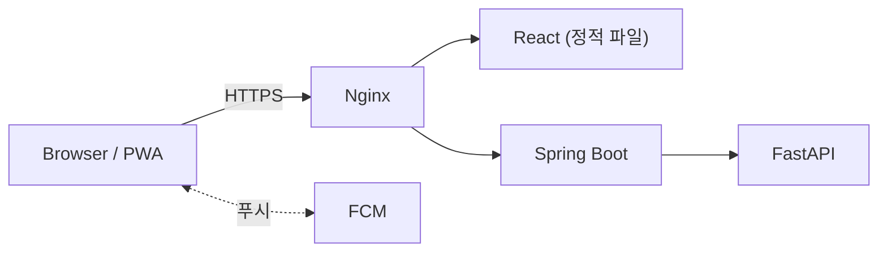

# ArcGuard Frontend

전기 설비 센서 데이터를 관제하고 AI 위험 진단을 보여주는 포트폴리오 프로젝트 **ArcGuard**의 프론트엔드입니다. React 19 + Vite로 PC 관제 콘솔과 모바일 PWA를 함께 구현했습니다.

**Live Demo** → https://arcguard.duckdns.org

| 역할 | 이메일 | 비밀번호 |
|---|---|---|
| 관리자 | admin1@arcguard.com | test1234! |
| 일반 사용자 | user1@arcguard.com | test1234! |

---

## 화면 구성

PC/모바일은 뷰포트가 아니라 URL 프리픽스(`/m/*`)로 나뉘며, 레이아웃부터 컴포넌트까지 서로 다른 별도 구현입니다(훅/API만 공유).

| 영역 | PC | 모바일 |
|---|---|---|
| 관제 | 대시보드, 알림 이력, 설비 모니터링 | 하단 탭 홈, 알림 |
| 관리 | 설비/직원/점검 관리 | 설비, 점검, 직원(조회 중심) |
| 통계 | 통계 화면 | — |

---

## Architecture



이 컨테이너 내부 nginx는 React 정적 파일 서빙과 SPA 라우팅 폴백만 담당합니다. HTTPS 종료와 `/api`·`/ws` 외부 라우팅은 ArcGuard 배포 구성의 edge nginx(`firesafety-be` 저장소)가 맡습니다.

---

## 핵심 기능

**인증** — HttpOnly Cookie로 토큰을 전달해 JS가 직접 접근하지 못하게 하고, 401 발생 시 자동으로 토큰을 재발급합니다.

**실시간 관제** — STOMP WebSocket으로 현장별 갱신 신호를 받아 REST로 재조회합니다. 역할에 따라 WS 구독(ADMIN/GENERAL) 또는 폴링(SUPER_ADMIN)으로 나뉘고, 연결이 끊기면 자동으로 폴링 전환됩니다.

**AI 진단 UI** — ML 판정(아크 판정/종합 위험도/이상 패턴/예상 전류)이 먼저 확정 표시되고, LLM 설명은 그 이후 별도 요청으로 이어집니다. LLM 요청이 실패해도 이미 표시된 ML 결과에는 영향이 없습니다.

**FCM Push** — 모바일 PWA에서 알림 권한 요청 → 서비스워커 등록 → 토큰 발급 → 서버 등록 순서로 동작하며, iPhone 홈 화면 PWA에서 실제 수신까지 확인했습니다.

---

## Tech Stack

React 19 · Vite · React Router 7 · axios · @stomp/stompjs · Recharts · Firebase(FCM) · ESLint

TypeScript/Redux/UI 라이브러리는 도입하지 않았고, 스타일은 CSS 변수 기반 클래스 시트로만 관리합니다.

---

## Engineering Highlights

**Same-origin API/WebSocket**
서버 주소를 코드에 박아두지 않고 `baseURL: '/api'`(상대경로)와 `location.protocol`만으로 요청을 구성했다. 도메인/HTTP→HTTPS 전환 시에도 프론트 코드는 바뀌지 않는다.

**ML/LLM UX 분리**
진단 실행 → ML 판정 확정 표시 → LLM 설명 순차 요청으로 나누고, 설명 요청 실패는 전역 알림 없이 별도 영역에서만 보여준다. LLM이 이미 나온 ML 결과에 영향을 주지 않는다는 관계를 UI로도 강제했다.

**FCM Service Worker를 빌드 시점에 생성**
`public/firebase-messaging-sw.js`가 gitignore 대상이라 git/CI 어디에도 존재하지 않아, production에서 이 경로가 SPA fallback(HTML)으로 응답되며 FCM이 항상 실패하고 있었다. 값이 없는 template과 build-time 생성 스크립트를 추가해 `npm run build`가 항상 최신 설정으로 파일을 만들도록 고쳤고, iPhone PWA 실제 수신까지 재확인했다.

**PC/모바일 완전 분리**
반응형 미디어쿼리 대신 라우트 메타데이터로 레이아웃을 분리해, 화면마다 실제 흐름이 다를 때(예: 모바일 알림은 목록이 아니라 설비 상세에서 처리) 조건문이 누적되지 않게 했다.

---

## CI/CD

`main` push 시 build → Docker 이미지(GHCR) → EC2 SSH로 frontend 컨테이너만 재배포합니다. Firebase 클라이언트 설정은 GitHub Actions Variables로 관리하며, 이미지에는 서버 secret이 포함되지 않습니다.

---

## Quality

`npm run build`/`npm run lint`로 검증합니다. Production build는 항상 PASS 상태이고, lint는 known technical debt로 `react-hooks/set-state-in-effect` 2건이 남아 있습니다(기능 오류 아님, 의도적으로 보류). 자동화된 테스트 러너는 없고 UI는 브라우저에서 직접 확인합니다.

---

## Repository

[firesafety-be](https://github.com/soyoung-v/firesafety-be) · [firesafety-fe-react](https://github.com/soyoung-v/firesafety-fe-react)(이 저장소) · [firesafety-ai](https://github.com/soyoung-v/firesafety-ai)

### Local Setup

```bash
cp .env.example .env.local   # API/WS proxy 대상 설정
npm install
npm run dev
```

---

## Scope

개인 포트폴리오 프로젝트이며, 실제 소방/전기안전 인증을 받은 제품이 아닙니다. 실 하드웨어가 아니라 Sensor Simulator가 생성하는 데이터를 기준으로 동작을 검증했습니다.
