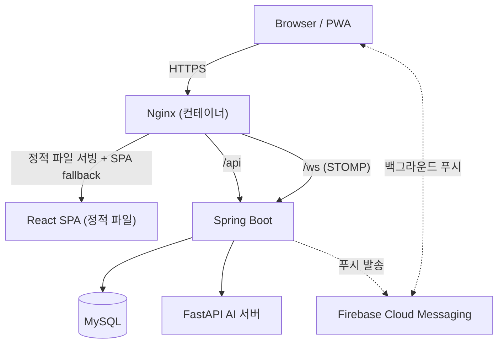

# ⚡ ArcGuard Frontend

전기 설비 센서 데이터 수집·관제 흐름을 Sensor Simulator로 재현하고, ML 기반 위험 진단과 LLM 설명
기능을 결합한 전기화재 예방 모니터링 포트폴리오, **ArcGuard**의 프론트엔드다. React 19 + Vite로
PC 관제 콘솔과 모바일 PWA를 함께 구현했고, 인증/실시간 관제/경보 처리/AI 진단 UI/FCM 푸시까지
실제 production에서 end-to-end로 동작한다.

**Live Demo** → https://arcguard.duckdns.org
**Swagger** → https://arcguard.duckdns.org/swagger-ui.html

### Demo 계정

| 역할 | 이메일 | 비밀번호 |
|---|---|---|
| 관리자 | admin1@arcguard.com | test1234! |
| 일반 사용자 | user1@arcguard.com | test1234! |

두 계정 모두 `ArcGuard 테스트 현장`에 접근 권한이 있고, 그 아래 테스트 분전반에는 Sensor Simulator로 생성한 센서·경보·AI 진단 데이터가 남아 있다.

---

## 화면 구성

PC/모바일 구분은 뷰포트가 아니라 **URL 프리픽스(`/m/*`)** 로만 한다. 두 화면은 레이아웃 셸부터
컴포넌트까지 서로 다른 구현이며, `useAuth`/`useSite`/`useMonitoring` 같은 훅과 API 함수만 공유한다.

### PC (`DefaultLayout` — 좌측 사이드바)

| 영역 | 화면 | 경로 |
|---|---|---|
| 인증 | 로그인 / 비밀번호 재설정 요청·확인 | `/login`, `/reset-password/*` |
| 현장 | 현장 선택 / 배정 현장 없음 | `/select-site`, `/site-unassigned` |
| 관제 | 대시보드 | `/dashboard` |
| 관제 | 알림 이력 | `/alerts` |
| 관제 | 설비 모니터링 목록 / 상세 | `/equipment`, `/equipment/:panelId` |
| 통계 | 통계 | `/statistics` |
| 관리 | 설비 관리(분전반·회로) / 변경 이력 | `/settings/facilities`, `/settings/facilities/history` |
| 관리 | 직원 관리 / 관리 이력 | `/settings/accounts`, `/settings/accounts/history` |
| 관리 | 점검 관리 / 점검 이력 | `/settings/inspections`, `/settings/inspections/history` |
| 시스템 | SW 버전 정보 | `/system/about` |

### 모바일 (`MobileLayout` — 하단 탭 + 드로어)

| 화면 | 경로 | 노출 위치 |
|---|---|---|
| 로그인 / 현장 선택 | `/m/login`, `/m/select-site` | — |
| 홈(대시보드) | `/m/dashboard` | 하단 탭 |
| 설비 | `/m/equipment`, `/m/equipment/:panelId` | 하단 탭 |
| 점검 | `/m/inspections` | 하단 탭 |
| 직원 | `/m/accounts` | 하단 탭 |
| 알림 이력 / 알림 설정 | `/m/alerts`, `/m/alerts/settings` | 헤더 종 아이콘 / 알림 목록 톱니 |

모바일은 현장 등록·수정·주소검색 같은 관리 액션이 없는 **선택·조회 전용** 화면이다. 설비 점검
(`REQ-511/512`)과 AI 진단(`REQ-102/103`)은 백엔드는 구현 완료 상태에서 이번 React 마이그레이션으로
새로 붙인 화면/기능이다. `REQ-701`(DB 연결 설정)·`REQ-703`(시스템 운영 로그)은 문서에는 남아 있지만
이 프로젝트 범위에서 route/menu/placeholder 어떤 형태로도 만들지 않았다.

---

## Frontend Architecture



이 컨테이너 내부의 `nginx.conf`는 React 정적 파일 서빙과 SPA 라우팅 폴백(`try_files ... /index.html`)만
담당한다. HTTPS 종료, `/api`·`/ws` 외부 라우팅은 ArcGuard 배포 구성의 edge nginx(`firesafety-be`
저장소가 소유)가 맡고, 이 컨테이너는 그 뒤에서 정적 파일만 서빙한다.

---

## 핵심 기능

### Authentication Flow

- 로그인(`POST /auth/login`) 성공 시 서버가 `{ userId, name, role }`만 응답 본문으로 내려주고,
  Access/Refresh Token은 **HttpOnly Cookie**(`Set-Cookie: at, rt`)로만 전달된다. 프론트 JS는 토큰
  값을 직접 읽거나 저장하지 않는다 — `localStorage`/`sessionStorage`에 담기는 건 `{ userId, name, role }`
  프로필뿐이다([authSession.js](src/features/auth/authSession.js)).
- 모든 요청은 `axios.create({ baseURL: '/api', withCredentials: true })`([httpRequester.js](src/shared/api/httpRequester.js))
  하나만 거친다. 401 응답 시 `/auth/reissue`로 재발급을 시도하고, 재발급이 진행 중이면 이후 401 요청은
  큐에 쌓아뒀다가 재발급 성공 시 한 번에 재시도한다(동시 다발 401에도 reissue는 1회만 호출).
- 재발급 자체가 실패(rt 만료)하면 세션을 정리하고 `window.location.href`로 로그인 화면에 풀 리로드
  이동한다(`?expired=1`). SPA 네비게이션이 아니라 하드 리다이렉트인 이유는 인증 상태 전체를 확실히
  리셋하기 위함이다.
- 권한 가드는 3단계로 분리되어 있다: `ProtectedRoute`(로그인 여부) → `RoleRoute`(역할 랭크 —
  `SUPER_ADMIN(3) > ADMIN(2) > GENERAL(1)`, 이상 비교) → `SiteRoute`(선택된 현장 존재 여부). 로그인
  화면은 반대로 `GuestRoute`가 이미 로그인된 사용자를 대시보드/현장 선택으로 되돌려보낸다.
- 로그아웃 시 `setLoggingOut(true)`로 인터셉터에 신호를 보내, 로그아웃 처리 중 뒤늦게 도착하는 401
  응답을 재발급 시도 없이 무시하게 한다.

### Realtime Monitoring

- WebSocket은 `@stomp/stompjs`(STOMP-over-WebSocket, SockJS 미사용)로 연결하며, 브로커 URL은
  `location.protocol`을 그대로 읽어 구성한다: `http:`이면 `ws:`, `https:`이면 `wss:` —
  서버 주소를 하드코딩하지 않고 현재 접속 오리진(`location.host`)을 그대로 쓴다
  ([monitoringSocket.js](src/features/monitoring/monitoringSocket.js)).
- 구독 destination은 현장별(`/topic/sites/{siteId}/monitoring`)이고, 메시지 본문에는 상세 데이터가
  없다(`{ eventType, occurredAt }`뿐). 메시지를 받으면 REST(`GET .../dashboard/summary`)로 재조회하는
  "새로고침 신호" 방식이다.
- **역할별 분기**: `SUPER_ADMIN`은 WS를 아예 구독하지 않고 15초 간격 REST 폴링만 사용한다. `ADMIN`/
  `GENERAL`은 담당 현장 topic을 구독하고, 연결이 끊기면(`onWebSocketClose`/`onStompError`) 자동으로
  폴링으로 전환한다(`MonitoringContext.jsx`). WS 재연결은 stompjs의 `reconnectDelay: 5000`으로 처리된다.
- 연결/구독/타이머는 모두 `useEffect` cleanup에서 `client.deactivate()` / `clearInterval` /
  `clearTimeout`으로 정리된다.
- 분전반 상태가 새로 `RISK`/`CAUTION`으로 전환되면(직전 조회와 비교) 팝업을 띄운다. `RISK`는 경보음
  (Web Audio API로 생성한 톤) + 상세 진입 시 자동 확인 처리, `CAUTION`은 톤만 다르고 경보음·자동확인은
  없다. 같은 주기에 둘 다 새로 전환됐으면 `RISK`가 우선한다.
- 짧은 시간에 WS 메시지가 몰리는 경우(일괄 확인/조치완료 등) 800ms 디바운스로 재조회를 한 번만
  실행해 REST 요청 폭주를 막는다.
- 경보 상태 전이는 `UNCONFIRMED → CONFIRMED → RESOLVED` 순서를 그대로 따른다. 위험 알림 상세 팝업의
  "상세보기"를 누르면 해당 분전반의 최신 미확인 경보를 자동으로 확인 처리한 뒤 설비 상세로 이동한다.

### AI Diagnosis UI

`SCR-202`(설비 상세)에 통합된 회로별 AI 진단이다 — 별도 라우트 없이 [CircuitDiagnosisModal](src/features/facilities/components/CircuitDiagnosisModal.jsx)
과 [PanelDiagnosisSummaryModal](src/features/facilities/components/PanelDiagnosisSummaryModal.jsx)
모달로 존재한다.

- **ML 판정과 LLM 설명은 명확히 분리된 두 단계다.** 진단 실행(`POST .../diagnosis/trigger`)은
  동기 호출이라 ML 판정 결과(아크 판정, 신뢰도, 종합 위험도, 샘플 수 등)가 먼저 화면에 확정 표시되고,
  그 이후에만 LLM 설명(`analysisSummary`) 생성 요청(`POST .../diagnosis/{resultId}/explanation`)이
  이어서 호출된다. 두 요청은 병렬이 아니라 순차다.
- **아크 판정(`verdict`: NORMAL/ARC)과 종합 위험도(`riskLevel`: NORMAL/WARNING/DANGER)는 서로 다른
  모델의 별개 출력이라 화면에서도 각각 다른 행으로 분리해서 보여준다** — `riskLevel=DANGER`를 "아크
  발생"으로 잘못 표시하지 않는다. 신뢰도(`confidence`), 이상 패턴 감지 여부(`anomaly`), 예측 전류
  (`predictedCurrent`) 등도 값이 있을 때만 조건부로 노출한다.
- LLM 설명이 이미 저장돼 있으면(`analysisSummary` 캐시 hit) 서버가 DB 값을 그대로 반환하고 OpenAI를
  재호출하지 않는다. 아직 없으면 별도 로딩 스피너("AI 분석 설명을 생성하는 중입니다...")를 보여준다.
- **LLM 설명 요청이 실패해도 이미 표시된 ML 진단 결과에는 영향을 주지 않는다.** `generateDiagnosisExplanation`
  호출은 `suppressGlobalAlert: true`로 보내 인터셉터의 전역 알림을 띄우지 않고, AI 분석 영역 안에서만
  실패 문구를 보여준다 — 즉 LLM은 위험을 판정하는 주체가 아니라 이미 나온 ML 결과에 대한 설명(부가
  기능)이라는 점을 UI로도 강제한다.
- 분전반 단위로는 진단 커버리지(`진단 회로 수 / 전체 회로 수`), 최근 24시간 판정·아크 건수, 최근
  판정/아크 판정/자동 진단 대기(샘플 부족) 3개 탭을 [PanelDiagnosisSummaryModal](src/features/facilities/components/PanelDiagnosisSummaryModal.jsx)에서
  한 번에 볼 수 있다.

### Firebase Cloud Messaging (FCM)

- FCM 웹푸시는 모바일 PWA 전용이다. 로그인 성공 후(또는 알림 설정 화면의 토글) `Notification.requestPermission()`
  → 별도 scope(`/firebase-cloud-messaging-push-scope`)로 서비스워커 등록 → `getToken(messaging, { vapidKey })`
  → 발급된 토큰을 `PATCH /users/me/fcm-token`으로 서버에 등록하는 순서다([fcm.js](src/features/auth/utils/fcm.js)).
  토글 OFF 시에는 같은 절차로 동일 토큰을 다시 얻어 `DELETE /users/me/fcm-token`으로 해제한다.
- "이 기기에 푸시가 등록돼 있는지"는 `localStorage`에 로컬 표시값(`fcmPushRegistered`)으로만 캐시하고,
  실제 등록 여부의 SSOT는 항상 서버(`user_fcm_token`)다.
- 백그라운드(탭 비활성/종료) 수신은 `public/firebase-messaging-sw.js`가 별도로 처리한다. `public/`은
  Vite가 번들링하지 않는 정적 경로라 `import` 문법을 못 쓰므로, Firebase 공식 가이드대로 compat CDN
  스크립트를 `importScripts`로 불러온다. 포그라운드 처리(`onMessage`)는 앱 코드가 아니라 이 서비스워커
  쪽에서 아직 별도 단계로 남아 있다.
- Vite는 `VITE_*` 값을 런타임이 아니라 **빌드 시점**에 번들에 굽는다. `VITE_FIREBASE_*` 7개는 클라이언트
  웹 설정(공개 식별자)이라 GitHub Actions repo Variables → Docker build-args → `Dockerfile`의
  `ARG`/`ENV` → `npm run build` 순으로 주입된다(아래 CI/CD 참고). 로컬 `.env.production`은 git에 커밋되지
  않는다.
- `public/firebase-messaging-sw.js`는 정적 파일이라 `import.meta.env`를 쓸 수 없어, git에는 실제 값이
  없는 `public/firebase-messaging-sw.template.js`만 추적하고 `scripts/generate-firebase-sw.mjs`가
  `npm run build`의 `prebuild` 훅으로 `VITE_FIREBASE_*` 환경변수를 그 자리에 채워 넣어 실제 파일을
  생성한다(값 누락 시 build 자체가 실패한다). 생성된 `public/firebase-messaging-sw.js`는 `.gitignore`
  대상이라 저장소에는 커밋되지 않는다 — local(`vite build`)과 CI/Docker(build-arg) 양쪽 경로가 이
  스크립트 하나로 동일하게 동작한다.
- Firebase Admin SDK 비밀키는 백엔드(서버) secret이며 프론트엔드 코드/이미지 어디에도 포함되지 않는다.
- iPhone 홈 화면에 설치한 PWA에서 실제 Web Push 수신까지 production QA로 확인했다.

### API 구조

- `shared/api/httpRequester.js`가 유일한 axios 인스턴스다. 화면/컴포넌트에서 axios를 직접 import하지
  않고 전부 이 인스턴스를 거친다. `baseURL: '/api'`는 **상대 경로 same-origin** 방식이라, dev에서는
  Vite `server.proxy`가, production에서는 Nginx가 각각 같은 오리진으로 라우팅한다 — 프론트 코드 어디에도
  백엔드 도메인이 하드코딩돼 있지 않다.
- 성공 응답은 `unwrap(res)`([response.js](src/shared/api/response.js))로 `resultData` 필드만 꺼내
  쓴다. 실패 시 서버 메시지 전역 알림(`showAlert`)은 인터셉터가 담당해서, 화면마다 중복 alert 로직을
  만들지 않는다.
- 호출부가 실패를 직접 다루겠다고 명시한 요청(예: AI 설명 생성처럼 실패해도 이미 표시된 다른 결과에
  영향을 주면 안 되는 보조 기능)은 요청 옵션에 `suppressGlobalAlert: true`를 실어 전역 알림을 건너뛴다.
- blob 응답(엑셀 export 등)의 에러 body도 Blob으로 오기 때문에 인터셉터에서 별도로 JSON 재파싱한다.

### UX / 공통 컴포넌트

`shared/components`는 역할별 폴더(`buttons` / `forms` / `feedback` / `modals` / `data-display` /
`layout`)로 구성되며, 실제로 여러 화면에서 공유되는 것만 여기 있다.

| 폴더 | 구성 요소 |
|---|---|
| `modals` | `BaseModal`(포커스 트랩 등 접근성을 담당하는 `useModalA11y` 훅 기반), `ConfirmModal`, `ActionResultModal`(성공/실패/경고 결과 + 부가 콘텐츠 슬롯) |
| `data-display` | `DataTable`(로딩/빈 상태 내장), `Pagination`, `BaseCard` |
| `feedback` | `LoadingState`, `ErrorState`(재시도 버튼 내장), `EmptyState`, `StatusBadge`, `AlertSeverityIcon`, `GlobalAlertHost`(인터셉터의 `showAlert` 큐를 렌더링) |
| `forms` | `Input`, `Select`, `Textarea`, `Checkbox` — 라벨/에러 메시지 연결 포함 |
| `layout` | `PageHeader`, `FilterBar`, `TabBar` |

- 대시보드의 위험 전환 팝업, 로그아웃 확인, 진단 실행 확인 등 앱 전체의 확인창은 전부 `ConfirmModal`
  하나로 통일돼 있다.
- 모바일 전용 UI(하단 탭 셸, 헤더 드로어)는 `layouts/MobileLayout`에 있고 PC의 `DefaultLayout`과
  컴포넌트를 공유하지 않는다 — 화면마다 실제 정보 구조와 상호작용 방식이 달라서(예: 모바일 알림은
  목록에서 바로 처리하지 않고 설비 상세로 넘겨 처리) 반응형 미디어쿼리 대신 별도 컴포넌트로 분리했다.

---

## Engineering Highlights

**A. Same-origin API/WebSocket, 도메인 하드코딩 제거**
- 문제: 백엔드 서버 주소가 프론트 코드에 박혀 있으면 배포 도메인이나 HTTP/HTTPS 전환 시 코드를 고쳐야
  한다.
- 원인: 흔한 구현은 `axios.create({ baseURL: 'https://api.example.com' })`처럼 절대 URL을 상수로 둔다.
- 해결: `httpRequester`는 `baseURL: '/api'`(상대 경로)만 쓰고, WebSocket 브로커 URL도
  `location.protocol`/`location.host`를 그 자리에서 읽어 구성한다(`monitoringSocket.js`). 실제 라우팅은
  dev의 Vite proxy, prod의 Nginx가 담당한다.
- 결과: HTTP → HTTPS 전환, 도메인 변경 시에도 프론트 코드는 한 줄도 바뀌지 않는다.

**B. ML 판정 / LLM 설명 UX 분리**
- 문제: AI 진단처럼 여러 모델이 관여하는 기능은 한쪽(LLM 설명)이 느리거나 실패할 때 다른 쪽(ML 판정)
  결과까지 함께 가려지기 쉽다.
- 원인: 두 호출을 하나의 로딩/에러 상태로 묶으면 LLM 실패가 곧 "진단 실패"로 보인다.
- 해결: 진단 실행 → ML 판정 확정 표시 → (판정 완료 후) LLM 설명 순차 요청으로 분리하고, 설명 요청은
  `suppressGlobalAlert: true`로 전역 알림도 따로 억제해 별도 영역에서만 실패를 보여준다
  (`CircuitDiagnosisModal.jsx`).
- 결과: LLM 설명이 느리거나 실패해도 이미 확정된 ML 판정(아크 여부·신뢰도·위험도)은 그대로 유지된다 —
  LLM은 위험을 판정하는 주체가 아니라 이미 나온 결과의 설명이라는 관계가 UI 동작으로도 강제된다.

**C. Firebase 값의 빌드 타임 주입(CI)**
- 문제: Vite는 `VITE_*` 값을 런타임이 아니라 빌드 시점에 번들에 굽기 때문에, CI 러너에는 존재하지 않는
  로컬 `.env.production`을 그대로 참조할 수 없다.
- 원인: `.env.production`은 git에 커밋하지 않는 파일(`gitignore`)이라 fresh checkout에는 없다.
- 해결: `VITE_FIREBASE_*` 7개(전부 공개 클라이언트 식별자, 서버 secret 아님)를 GitHub Actions repo
  Variables로 등록하고, `docker/build-push-action`의 `build-args`로 전달 → `Dockerfile`의 `ARG`를
  `ENV`로 노출해 `vite build`가 `process.env`에서 읽도록 했다.
- 결과: 로컬 개발자별 `.env.production` 파일 유무와 무관하게 CI 빌드는 항상 동일한 Firebase 설정으로
  재현 가능하다.

**D. Frontend → Nginx 기동 순서**
- 문제: 상위 Nginx는 `frontend`/`backend` 컨테이너를 정적 upstream hostname으로 `proxy_pass`하는데,
  이 hostname을 설정 로드 시점에 한 번 resolve하고 실패하면 기동 자체를 거부한다.
- 원인: `docker compose up`으로 `frontend`와 `nginx`를 동시에 올리면 DNS 해석 순서에 따라 Nginx가
  아직 뜨지 않은 hostname을 참조해 기동이 실패할 수 있다.
- 해결: 배포 워크플로(`deploy.yml`)에서 `frontend` 컨테이너를 먼저 `up -d --no-deps frontend`로 띄운
  뒤에만 `nginx` 컨테이너를 `up -d --no-deps nginx`로 기동한다.
- 결과: 최초 부트스트랩(프론트가 방금 처음 뜬 상황)에서도 Nginx가 hostname resolve에 실패하지 않는다.

**E. Firebase Service Worker를 빌드 시점에 생성해 gitignore와 배포를 양립시키기**
- 문제: `public/firebase-messaging-sw.js`가 `.gitignore` 대상이라 git/CI 어디에도 존재한 적이 없었고,
  production에서 이 경로를 요청하면 파일이 없어 SPA fallback(`index.html`)이 대신 응답하며 Service
  Worker 등록 자체가 항상 실패해 FCM 푸시가 production에서 전혀 동작하지 않는 상태로 배포돼 있었다.
- 원인: 이 파일이 실제 Firebase 설정값을 담아야 하는데, Vite의 `import.meta.env` 빌드 치환은 모듈
  그래프 안에서만 동작해서 `public/` 정적 파일에는 적용되지 않는다 — 그래서 과거에는 로컬에서 값을
  직접 하드코딩해 임시로 두는 방식으로 우회했고, 그 파일 자체를 git에서 제외해버려 CI/배포 경로에서는
  아예 빠져 있었다.
- 해결: 실제 값이 없는 template(`firebase-messaging-sw.template.js`, git 추적)과 이를
  `VITE_FIREBASE_*` 환경변수로 채우는 생성 스크립트를 추가하고, `npm run build`가 `prebuild` 훅으로
  항상 먼저 실행하도록 연결했다. local(`vite build`)과 CI/Docker(build-arg) 양쪽이 같은 스크립트를
  거치도록 CI의 sanity build 단계에도 동일한 env를 주입했다. 값이 하나라도 없으면 조용히 잘못된 파일을
  만드는 대신 build 자체가 exit 1로 실패한다.
- 결과: production 재배포 후 실제 iPhone PWA에서 Web Push 수신까지 확인했다. 이 과정에서 기존에
  하드코딩돼 있던 값이 현재 쓰는 Firebase 프로젝트가 아니라 이전 프로젝트를 가리키고 있었다는 것도
  함께 발견해 정리했다.

**F. PC/모바일 완전 분리 구조**
- 문제: 반응형 미디어쿼리로 같은 컴포넌트를 늘어뜨리면, 화면마다 실제 흐름이 다를 때(예: 모바일은
  알림을 목록에서 바로 처리하지 않고 설비 상세로 넘김) 조건문이 누적되며 복잡해진다.
- 원인: PC 관리 콘솔과 모바일 현장 실사용 화면은 정보 구조 자체가 다르다.
- 해결: `layout: 'default' | 'mobile'` 메타데이터로 라우트를 분리하고(`routeConfig.js`), `Mobile` 접두사
  페이지/레이아웃을 별도 컴포넌트로 둔 채 `useAuth`/`useSite`/`useMonitoring` 같은 훅과 API 함수만
  공유한다.
- 결과: 두 화면의 UI 변경이 서로의 조건 분기에 영향을 주지 않는다.

**G. 이전 Vue 구현에서 React로 전환**
- 이 프론트엔드는 처음부터 React였던 것이 아니라, 이전 Vue 3 구현의 화면·API 계약·권한 흐름을 기준으로
  삼되 코드 구조와 공통 컴포넌트는 React 방식으로 새로 설계해 옮긴 결과다. 마이그레이션 자체보다,
  옮기는 과정에서 상태관리를 전역 스토어 대신 필요한 곳에만 React Context를 두는 방식으로 다시
  설계한 것과 위 A~F의 구조적 개선들이 실질적인 작업이었다.

---

## Tech Stack

| 구분 | 기술 |
|---|---|
| 언어 | JavaScript + JSX |
| 프레임워크 | React 19 |
| 빌드 도구 | Vite 8 (`@vitejs/plugin-react`) |
| 라우팅 | React Router 7 |
| HTTP | axios |
| 실시간 통신 | `@stomp/stompjs` (STOMP over WebSocket) |
| 차트 | Recharts |
| 푸시 알림 | firebase (FCM) |
| 상태관리 | React Context(인증/현장/실시간 관제 — 전역이 꼭 필요한 상태만) + 로컬 state |
| Lint | ESLint (`eslint-plugin-react-hooks`, `eslint-plugin-react-refresh`) |

버전은 `package.json` 기준(`^` 범위):

```
react ^19.2.7          react-dom ^19.2.7
react-router-dom ^7.18.2
axios ^1.19.0
firebase ^12.18.0
@stomp/stompjs ^7.3.0
recharts ^3.10.1
vite ^8.1.1             @vitejs/plugin-react ^6.0.3
eslint ^10.6.0
```

TypeScript/Redux/Tailwind/CSS-in-JS/UI 컴포넌트 라이브러리는 도입하지 않았다 — 스타일은 CSS 변수
(`shared/styles/tokens.css`) 기반 클래스 스타일시트로만 관리한다.

---

## CI/CD

`main` 브랜치 push 시 [`.github/workflows/deploy.yml`](.github/workflows/deploy.yml)가 실행된다.

```
push main
  → npm ci && npm run build   (build 성공이 필수 조건)
  → docker/build-push-action (linux/amd64, VITE_FIREBASE_* 7개를 build-args로 주입)
  → ghcr.io/<owner>/arcguard-frontend:<sha12> / :latest 로 push
  → EC2 SSH 접속(appleboy/ssh-action, 커밋 SHA로 버전 고정)
     → docker compose pull/up frontend
     → docker compose up nginx (frontend 기동 후)
     → deploy/scripts/health-check.sh frontend
```

- 자동 테스트 러너는 없다 — `npm run build` 성공이 유일한 배포 게이트다. `npm run lint`는 CI에서
  강제 조건으로 걸려 있지 않다(기존에 존재하는 lint 이슈를 이번 Phase에서 배포 blocker로 만들지 않기로
  한 방침).
- Firebase 클라이언트 웹 설정 7개(`VITE_FIREBASE_*`)는 GitHub Actions repo **Variables**로, EC2 SSH
  키·호스트 등은 repo **Secrets**로 분리돼 있다. 서버 secret(Firebase Admin 키 등)은 이 이미지에
  포함되지 않는다.

---

## Repository

| 레포 | 역할 |
|---|---|
| [firesafety-fe-react](https://github.com/soyoung-v/firesafety-fe-react) | 프론트엔드 (이 저장소) — React 기반 관제·설비관리·AI 진단 UI |
| `firesafety-be` | 백엔드 — Spring Boot API, WebSocket(STOMP), 인증, 알림 발송 |
| `firesafety-ai` | AI 진단 서버 — FastAPI 기반 아크 판정 ML 모델, LLM 설명 생성 |

---

## Local Setup

### 요구사항

- Node.js (Vite 8 요구 버전)
- 로컬 API 연동 확인을 위해 `firesafety-be` 백엔드가 8080 포트로 떠 있어야 한다

### 1. 환경변수

```bash
cp .env.example .env.local
```

`VITE_DEV_API_PROXY_TARGET` / `VITE_DEV_WS_PROXY_TARGET` (미설정 시 `http://localhost:8080` 폴백)만
채우면 된다. `.env.local`은 git 추적 대상이 아니다.

FCM을 실제로 테스트하려면 `.env.production.example`을 참고해 `.env.production`을 만들고
`VITE_FIREBASE_*` 값을 채운다 — Vite는 이 파일을 `vite build`/`vite preview`에서만 읽고 `vite dev`에서는
읽지 않는다. 실제 Firebase 값/secret은 커밋하지 않는다.

### 2. 개발 서버

```bash
npm install
npm run dev
```

### 3. 검증

```bash
npm run lint
npm run build
```

자동 테스트 러너는 없다. UI 변경은 `npm run dev`로 브라우저에서 직접 확인한다.

### 4. 운영 빌드(로컬에서 이미지만 확인할 때)

```bash
docker buildx build --platform linux/amd64 -t arcguard-frontend:latest --load .
```

이 컨테이너 nginx는 `/api`·`/ws`를 프록시하지 않는다(edge nginx의 책임, `firesafety-be` 저장소) —
로컬에서는 정적 파일 서빙과 SPA 라우팅 폴백만 확인할 수 있다.

---

## Quality

- `npm run build`(Vite 빌드 성공)와 `npm run lint`(ESLint, React Hooks 규칙 포함)로 검증한다. Production
  build는 항상 PASS 상태를 유지했고, 이번 QA에서 자동/수동 회귀를 함께 확인했다.
- lint는 known technical debt로 `react-hooks/set-state-in-effect` 규칙 위반 2건이 남아 있다 — 둘 다
  "데이터 변경 시 state를 보정/리셋"하는 정상 동작 패턴이라 기능 오류는 아니며, 더 넓은 구조(모달 리셋,
  현장 선택 SSOT)와 얽혀 있어 지금 리팩터링하는 대신 의도적으로 남겨뒀다.
- 자동화된 테스트 러너(Jest/Vitest 등)는 없다 — UI 동작 확인은 `npm run dev` 후 브라우저에서 골든
  패스·엣지케이스를 직접 확인하는 방식이다.

---

## Project Scope

- 개인 포트폴리오 프로젝트이며, 실제 소방/전기안전 인증을 받은 제품이 아니다.
- 실 현장 하드웨어가 아니라 시뮬레이터가 생성하는 센서 데이터를 기준으로 동작을 검증했다.
